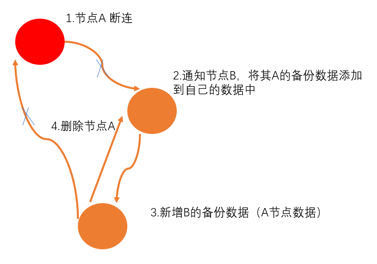
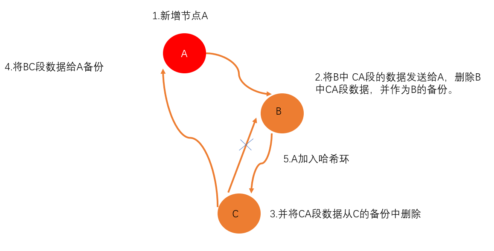

# 分布式K-V缓存系统


## **简介**

1.使用muduo网络库，通过**跳表**实现的基于内存的分布式**K-V缓存系统**。

2.利用**一致性哈希算法**，实现负载均衡。

3.单一节点故障不影响系统使用，**自动进行数据迁移备份**,可以动态增加新的存储节点，系统会通过一致性哈希算法自动映射和备份数据。

4.利用LRU缓存在coserver中快速找到最近的数据。

5.灵活增添-减少节点，可以灵活在系统运行时添加/减少存储服务器节点，对客户端不可见。

使用方法：

```sh
cd build
cmake ..
make
```

生成的可执行文件在bin目录

1.运行coserver -- 中心调度节点（用于客户端请求，以及存储节点的调度）

```sh
./coserver
```

2.运行slaveServer -- 一个或多个，服务存储节点，通过一致性哈希算法将数据映射到各个存储节点中。可以动态加入或者删除。  


参数 :  

./slaveserver coserverIP coserverPort slaveserverIP slaverserverPort

```sh
./slaveserver 127.0.0.1 8000 127.0.0.1 6666
./slaveserver 127.0.0.1 8000 127.0.0.1 6667
```

3.运行客户端 cacelient

客户端有四种命令

```sh
./cacelient
# 四种命令分别对应增删改查
# put:key:value
# get:key
# update:key:value
# delete:key 
```


## 系统设计

​		client ， coserver（一个），slaveServer（一个或多个）

### client 

​		客户端，用于向coserver发送增删改查的请求，并接受coserver的返回数据。

### **coserver**

​		中心调度服务器。作为服务器用于监听客户端的请求，以及作为客户端向slaveServer发送增删改查的请求。当有slaveServer连接时候，slaveServer作为客户端主动向coserver发送连接请求。coserver将接受的slaveServer的ip+端口注册到哈希环上，并保存客户端连接。若有客户端用户的查询数据，利用一致性哈希算法计算，找到哈希环上对应的客户端连接，向对应的slaveServer发送请求数据。并使用LRU算法进行缓存，下次若有请求则直接返回。做put节点放置时候，需要利用下一个节点进行备份，同时put到当前节点和下一个节点中。若访问的当前节点挂掉，则会访问下一个节点（缓存的数据）并返回。中心调度服务器保存有各个存储节点的tcp连接，每隔30s发送一个心跳包，确认连接是否畅通。如果节点没有回复，则说明连接断开，采用数据备份，将服务器数据备份到下一个节点。



​		当有新的coserver连接，计算其哈希值，注册到哈希环中，并将涉及到哈希节点改动的数据进行数据迁移并备份。将不在哈希节点中的数据进行删除。

​	

​		利用一个心跳包监听各个slaveServer和coserver是否断开，每30秒监听一次，如果断开，则删除该节点。并将该节点的数据备份到下一个节点的下一个节点。

### **slaveServer**

​		分布式的存储节点，每个节点有ip_port命名，当slaveServer初始化时候，会作为客户端给coserver发送注册消息，该slaveServer被注册到哈希环上。每个slaveServer都有其独立的基于跳表的K-V缓存系统，并提供了增删改查功能。作为服务器，并与coserver建立长连接。

